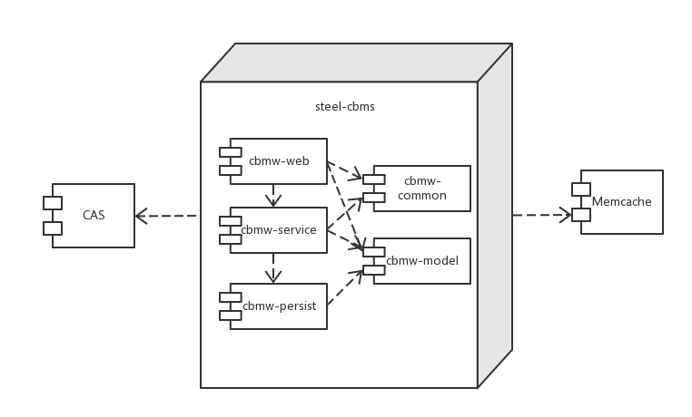
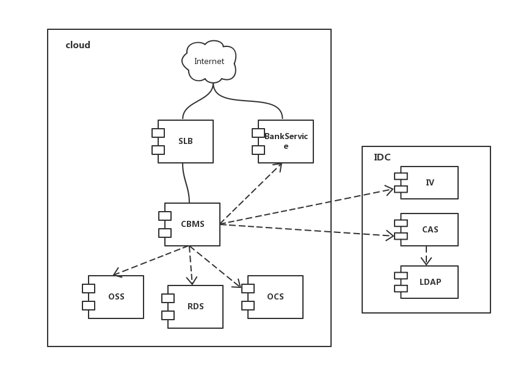

# 品牌店代运营系统

## 项目依赖关系



## 项目部署图



## 项目环境配置说明

### 开发环境
提供给开发人员进行程序/功能开发测试使用的环境。

* 服务器介绍

| IP |账号/密码| 操作系统 |
| -------- | -------- | -------- |
| 192.168.0.209 | luoliang/luoliang | Ubuntu 14.04 |

* 软件类别

| 名称 | 版本 | 路径 | 备注 |
| -------- | -------- | -------- | -------- |
| Tomcat | 7.0.62 | /home/luoliang/tomcat7 | / |
| Mysql | 5.6.25 | -- | / |


如何在DEV服务器查看Tomcat日志？
```shell
ssh luoliang@192.168.0.209
tail -f tomcat7/logs/catalina.out
```

* 数据库

| 名称 | IP | 端口 |账号/密码| 备注 |
| -------- | -------- | -------- | -------- | -------- |
| steel_cbms | 192.168.0.209 | 3306 | root/root | 主数据 |
| cbms_receipt | 192.168.0.209 | 3306 | root/root | 爱信诺 |

* 依赖服务列表

| 名称 | IP | 端口 |备注 |
| -------- | -------- | -------- | -------- |
| Memcached | 192.168.0.206 | 11211 | / |
| LDAP | 192.168.0.209 | 389 | [LDAP管理平台](http://192.168.0.75/phpldapadmin/htdocs/cmd.php?server_id=3&redirect=true) 账号：cn=admin,dc=prcsteel,dc=com 密码：root |
| 银企直连 | http://192.168.0.213:8013/cbmspay/accountService | 8013 | / |
| 短息服务 | http://api.prcsteel.com/Service/SMSService.asmx | / | 默认关闭 |


### 测试环境

提供给测试人员进行程序/功能测试使用的环境。

* 服务器介绍

| IP |账号/密码| 操作系统 |
| -------- | -------- | -------- |
| 192.168.0.206 | prcsteel/prcsteel | Ubuntu 14.04 |

* 软件类别

| 名称 | 版本 | 路径 | 备注 |
| -------- | -------- | -------- | -------- |
| Tomcat | 7.0.62 | /home/prcsteel/*tomcat* | / |
| Mysql | 5.6.25 | -- | / |

* 数据库

| 名称 | IP | 端口 |账号/密码| 备注 |
| -------- | -------- | -------- | -------- | -------- |
| steel_cbms | 192.168.0.206 | 3306 | root/root | CBMS WBE版使用 |
| steel_cbms_app | 192.168.0.206 | 3306 | root/root |  CBMS App版使用 |
| steel_cbms_V1.2.0 | 192.168.0.206 | 3306 | root/root |  CBMS Web 1.2版使用 |
| cbms_receipt | 192.168.0.206 | 3306 | root/root | 爱信诺 |

* 依赖服务列表

| 名称 | IP | 端口 |备注 |
| -------- | -------- | -------- | -------- |
| Memcached | 192.168.0.206 | 11211 | / |
| LDAP | 192.168.0.206 | 389 | [LDAP管理平台](http://192.168.0.75/phpldapadmin/htdocs/cmd.php?server_id=4&redirect=true) 账号：cn=admin,dc=prcsteel,dc=com 密码：123456 |
| 银企直连 | http://192.168.0.213:8013/cbmspay/accountService | 8013 | / |
| 短息服务 | http://api.prcsteel.com/Service/SMSService.asmx | / | 默认关闭 |

### 仿真环境

提供给测试人员、产品、部分用户进行验收测试使用的环境。

* 服务器介绍

| IP |账号/密码| 操作系统 |
| -------- | -------- | -------- |
| / | / | Ubuntu 14.04 |

* 软件类别

| 名称 | 版本 | 路径 | 备注 |
| -------- | -------- | -------- | -------- |
| Tomcat | 7.0.62 | /opt/tomcat | / |
| Mysql | 5.6.25 | / | / |

* 数据库

| 名称 | IP | 端口 |账号/密码| 备注 |
| -------- | -------- | -------- | -------- | -------- |
| steel_cbms | / | / | / | CBMS WBE版使用 |
| cbms_receipt | / | / | / | 爱信诺 |


### WEB应用列表

| 服务器 | URL |账号/密码| Hosts |
| -------- | -------- | -------- | -------- |
| DEV（开发环境） | http://cbmsdev.com:8080/web/index.html | cbadmin/cbadmin | 192.168.0.209 cbmsdev.com 192.168.0.209 ssodev.com |
| TEST（测试环境） | http://cbmstest.com:8011/web/index.html | cbadmin/123456 | 192.168.0.206 cbmstest.com 192.168.0.206 ssotest.com |
| SIM（仿真环境） | http://cbmssim.com:8080/web/index.html | / | 192.168.0.204 cbmsim.com |
| LOCAL（本地环境） | http://localhost.com:8000/web/index.html | cbadmin/cbadmin | / |
注：仿真环境账号密码与iwork一致，但登入后没有权限，需要联系管理员分配权限。

### 其他工具

| 名称 | URL | 管理员 | 备注 |
| -------- | -------- | -------- | -------- |
| Jenkins | http://192.168.0.200:8080/jenkins/ | 余秀军 & 罗亮 | 工程: 1. [开发环境](http://192.168.0.200:8080/jenkins/view/dev_build/) ; 2. [仿真环境](http://192.168.0.200:8080/jenkins/view/sim_build/) ; 3. [正式环境](http://192.168.0.200:8080/jenkins/view/sim_build/)|
| Sonar | http://192.168.0.200:9000/dashboard/index/com.prcsteel.cbms | admin/admin | 代码质量 |
| Gerrit | http://192.168.0.205/ | 周坤 | Code Review |


## 目录说明

| 目录名称 | 目录说明 |
| -------- | -------- |
| doc | 项目文档目录 |
| doc/script | 脚本文件 |
| doc/design | 设计文档 |
| bin | 脚本目录 |

## 技术与工具

## 主要技术

1. JDK 1.8
2. Apache Maven 3.2.3
3. Spring 4.1.1.RELEASE
4. MyBatis 3.1.1
5. Velocity 1.7
6. Apache Shiro 1.2.3
7. CAS Server 4.0.0
8. MySql 5.6
9. Memcached Server
10. OpenLDAP
11. Tomcat 7.x
12. Apache Maven 3.x
13. LTS [light-task-scheduler](http://git.gtxh.cn/luoliang/light-task-scheduler) 

### 工具

1. IntelliJ IDEA 14.0.1
2. ArgoUML 0.34
3. Mysql Workbench 6.2
4. Zookeeper

## 如何使用
前提条件：您已正确配置JAVA、Maven、Nexus环境。

### CAS服务器部署
1. 下载[cas.war](http://icloud.gtxh.cn:88/owncloud/public.php?service=files&t=d6484e134b1156ed40cc385f958af9ce), 密码：cbms
2. 将WAR文件拷贝到TOMCAT_HOME/webapps/目录下, 启动tomcat
3. 浏览：[http://localhost:8080/cas](http://localhost:8080/cas/)
4. 登录测试，账号密码：test


### LTS（任务调度系统）部署参考

[LTS项目说明](http://git.gtxh.cn/luoliang/prcsteel-lts)

### 本地开发应用部署

1.Tomcat配置修改，文件路径%TOMCAT7_PATH%/conf/tomcat-users.xml

```shell
    <role rolename="manager-gui"/>
    <role rolename="manager-script"/>
    <user username="admin" password="admin" roles="manager-gui,manager-script" />
```

2.修改Maven配置，文件路径：%MAVEN_PATH%/conf/settings.xml

```shell
    <server>
        <id>tomcat</id>
        <username>admin</username>
        <password>admin</password>
    </server>
```

3. 启动Tomcat后，并在项目（steel-cbms）根目录下执行命令：

```shell
    cd steel-cbms
    mvn tomcat:deploy -DskipTests
```


### 编译并启动steel-web工程
1. 安装static
```shell
cd steel-cbms/platform/static
mvn install
```

2. 安装prcsteel modules
```shell
cd steel-cbms
mvn install
```

3. 在Tomcat中运行web工程
方法一：
```shell
cd steel-cbms/platform/order/web
mvn tomcat:run-war
```
方法二：
先手工删除位于“steel-cbms/platform/order/web/src/main/webapp/WEB-INF/”目录下的classes和lib文件夹
```shell
cd steel-cbms/platform/order/web
mvn tomcat:run
```
浏览：[http://localhost:8000/web/index.html](http://localhost:8000/web/index.html)

### 生成Mybatis代码
前提：数据库连接已配置
1. 修改generatorConfig.xml文件，添加相应的Table
```html
<context>
    ...
    <table schema="steel_cbms" tableName="acl_org"/>
    <!--Add more here -->
    ...
</context>
```

2. 执行命令
```shell
cd steel-persist
mvn clean install -Dmaven.test.skip
mvn mybatis-generator:generate
```
代码将生成在target/generated-sources/mybatis-generator目录下。

### 数据初始化

```shell
cd steel-persist
mvn sql:execute
```
注意：数据库初始化时可指定环境、版本、目录、文件4个参数，默认执行当前版本下所有sql脚本。
下面这个示例是指定在dev环境下执行“1.0”版本“upgrade”目录“insert.sql”脚本。
```shell
cd steel-persist
mvn sql:execute -Pdev -Dsql.version=1.0 -Dsql.dir=upgrade -Dsql.file=insert.sql
```


## 相关软件
地址：\\192.168.0.250\sharegit \java_tools_windows-x64

## CBMS产品设计文档
参考：[http://git.gtxh.cn/root/steel-cbms-doc.git](http://git.gtxh.cn/root/steel-cbms-doc.git)